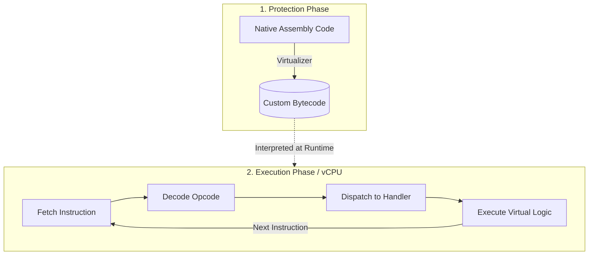

# 🛡️ Aegis64

<p align="center">
  <!-- PLACEHOLDER: You can add an 800x200 project banner image here and save it as assets/banner.png -->
  <!--  -->
</p>

[]()
[]()
[]()
[]()
[](LICENSE)

Aegis64 is a proof-of-concept code virtualization engine for 64-bit Windows PE (Portable Executable) files. It translates native x86-64 assembly code into a custom bytecode format, which is then executed by a dedicated virtual machine. This process obfuscates the original program logic, making it significantly more difficult to reverse engineer.

The virtualizer works by locating user-defined code blocks marked by special functions, lifting the instructions within those blocks, and replacing them with a jump to a custom VM engine injected directly into the executable.

---

## ✨ Features

*   **x86-64 Code Virtualization**: Translates native 64-bit instructions into a proprietary custom bytecode.
*   **Custom Stack-Based VM**: A compact, position-independent virtual machine written entirely in NASM assembly to interpret the bytecode at runtime.
*   **Marker-Based Protection**: Uses `Aegis64_Begin()` and `Aegis64_End()` function calls from a helper DLL to easily define targeted virtualization zones.
*   **Dynamic Instruction Lifting**: The core engine (`Aegis64.exe`) utilizes the **Capstone Engine** to disassemble instructions and **LIEF** to analyze and patch the PE file on disk.
*   **Seamless PE Modification**: Automatically creates and injects a new `.aegis` section into the target executable to host both the VM engine and the generated bytecode payload.
*   **Clean Artifacts**: The final protected executable is stripped of its dependency on the marker `Aegis64SDK.dll`, leaving a standalone obfuscated binary.

---

## ⚙️ How It Works

Code virtualization protects software by converting standard, easily readable machine code into a unique, undocumented bytecode format. Instead of the physical CPU executing the code directly, a software-based Virtual Machine (VM) interprets it at runtime.

Here is a general overview of how software virtual machines operate:



1.  **Translation**: A virtualizer tool strips away the original native instructions (like x86 or ARM) and translates them into a completely new, custom instruction set architecture (bytecode) designed specifically for the VM.
2.  **Execution Loop**: When the program runs, the embedded Virtual CPU (vCPU) takes control. It enters a continuous loop where it **fetches** the next piece of custom bytecode, **decodes** what virtual operation it represents, and **dispatches** it to a specific handler function to **execute** the logic.
3.  **Context Isolation**: All of this happens within a virtualized state. The registers, stack, and memory operations are managed internally by the VM, effectively masking the true logic from reverse engineers analyzing the physical execution flow.

---

## ⚠️ Limitations

As a proof-of-concept, Aegis64 is intentionally lightweight and has strict operational constraints:

*   **Scope of Emulation**: The VM is designed exclusively to protect **specific, sensitive calculation instructions** (e.g., proprietary math, cryptographic routines, or licensing algorithms). It is not a general-purpose emulator.
*   **External Calls & VM Crashes**: Because of its narrow scope, the VM **cannot handle external Windows API calls or complex system interactions**. Attempting to virtualize blocks of code that invoke external libraries, rely on system calls, or utilize unsupported x86-64 opcodes will cause the VM to **crash**. You must strictly isolate your mathematical and logical operations from any external system interactions before applying the `Aegis64_Begin()` and `Aegis64_End()` markers.
*   **Performance Overhead**: Code executed inside the virtual machine runs significantly slower than native execution due to the software-based fetch-decode-execute loop. This reinforces the need to only mark specific, critical logic blocks rather than entire application flows.
*   **Windows x64 Only**: The engine strictly targets 64-bit Windows PE files. 32-bit (x86) executables and other file formats (like ELF or Mach-O) are not supported.

---

## 📂 Project Structure

```text
Aegis64/
├── Aegis64/            # C++ source for the main lifter/virtualizer engine
├── Aegis64SDK/         # Visual Studio project for the marker DLL (Aegis64SDK.dll)
├── Aegis64_VM/         # NASM source for the virtual machine interpreter
│   └── aegis_vm.asm
├── test/               # Example targets for virtualization
│   └── protectme_1/    # Demo C++ project utilizing the SDK markers
├── LICENSE
└── README.md
```

---

## 🛠️ Build and Usage

### Prerequisites
*   **Visual Studio 2022** (C++ Desktop Development workload)
*   **NASM** (Must be added to system PATH)
*   **LIEF** (For parsing/modifying PE files)
*   **Capstone** (For x86-64 disassembly)

### Build Steps

1.  **Build the VM Engine**:
    Assemble the VM source code into a flat binary file.
    ```sh
    nasm -f bin Aegis64_VM/aegis_vm.asm -o aegis_vm.bin
    ```
    *Note: Place the resulting `aegis_vm.bin` in the same directory where `Aegis64.exe` will be built (e.g., `Aegis64/x64/Release`).*

2.  **Build the SDK**:
    Open `Aegis64SDK/Aegis64SDK.sln` in Visual Studio and build the solution for the `Release | x64` configuration. This generates `Aegis64SDK.dll` and `Aegis64SDK.lib`.

3.  **Build the Virtualizer**:
    *   Configure the **LIEF** and **Capstone** libraries in the `Aegis64` project properties (Include Directories & Library Directories).
    *   Open `Aegis64/Aegis64.sln` and build the project for the `Release | x64` configuration.

4.  **Build the Test Application**:
    *   Open `test/protectme_1/protectme.sln`.
    *   In the project properties (`Linker -> General -> Additional Library Directories`), add the path to your compiled `Aegis64SDK.lib`.
    *   Build the project (`Release | x64`).
    *   Copy `Aegis64SDK.dll` to the same directory as the newly compiled `protectme.exe`.

### Virtualization

To virtualize the test application, execute `Aegis64.exe` from your command line, passing the target executable as an argument.

```sh
# Ensure aegis_vm.bin is in the same directory as Aegis64.exe
.\Aegis64.exe C:\path\to\protectme.exe
```

A new file named `protectme.exe_protected.exe` will be generated. This protected binary is fully standalone and no longer requires the SDK DLL to run.

---

## 👨‍💻 Author

**Homoud H. Aljudaiby**

---

## ⚖️ Disclaimer

This project is developed strictly for educational purposes, low-level security architecture research, and understanding code obfuscation techniques. Do not use this tool to pack or obfuscate malicious payloads.

## 📄 License

This project is licensed under the MIT License. See the [LICENSE](LICENSE) file for details.
